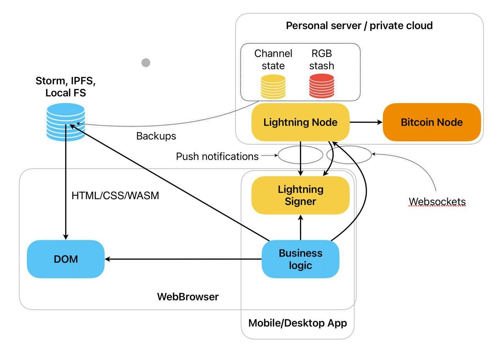
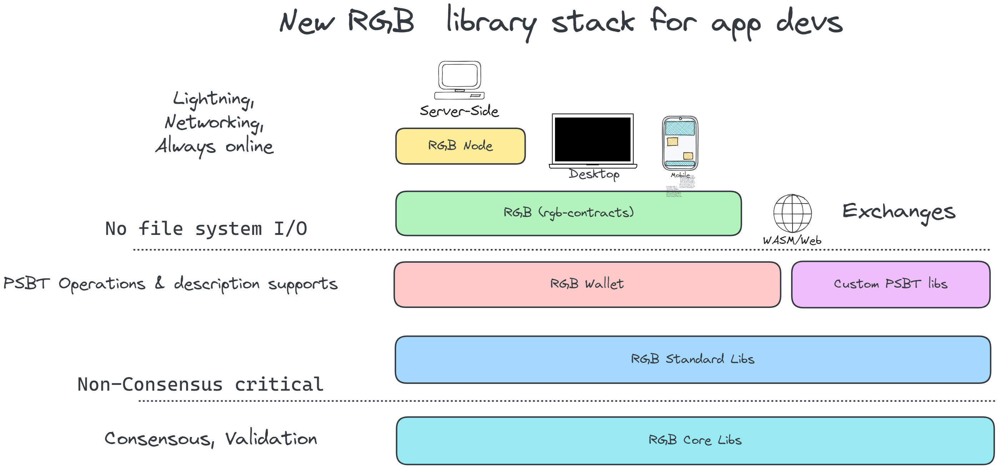
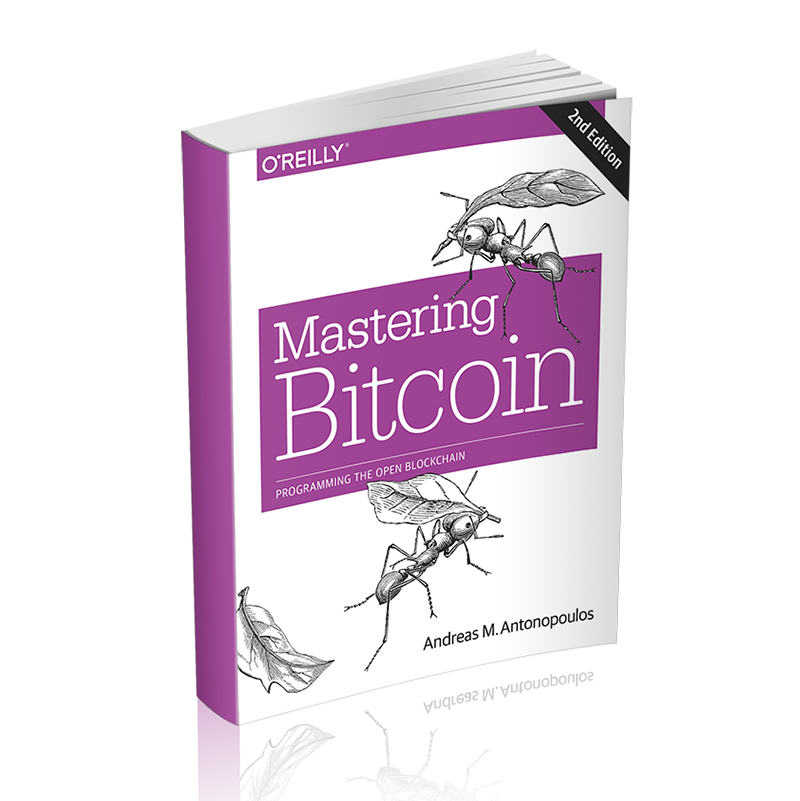

# 

# What is RGB?

- RGB is a scalable & confidential smart contracts system for Bitcoin & lightning network. They embrace concepts of private & mutual ownership, abstraction and separation of concerns and represent "post-blockchain", Turing-complete form of trustless distributed computing which does not require introduction of "tokens".
- RGB is not a token protocol. Though issuance and management of highly scalable, programmable and private assets of different sort is possible with RGB, it can be applied in many industries far beyond financial world.

As a smart contract system RGB is quite different from previous approaches, both Bitcoin-based (Colored coins, Counterparty, OMNI) and non-bitcoin (Ethereum, EOS and others):

- RGB separates concept of smart contract issuer, state owners and state evolution
- RGB keeps the smart contract code and data off-chain
- RGB uses blockchain as a state commitment layer and Bitcoin script as an ownership control system; while smart contract evolution is defined by off-chain schema
  
## Core underlying concepts
In order to understand technical details behind RGB one has to become familiar with the following concepts, which are heavily used in RGB design:

- Distributed systems (replicated state machines), including
    - PRISM (partially-replicated infinite state machines) computing
    - AluVM instruction set architecture
- Non-imperative computing, including
    - Declarative functional programming
    - Cellular automation
- Zero knowledge protocols, including
    - Confidential transactions
    - Bulletproofs
- Cryptographic commitment schemes, including
    - BIP-340 tagged hashes
    - Advanced merklization schemes (LNPBP-81)
    - Multi-message commitments (LNPBP-4)
    - Deterministic bitcoin commitments (LNPBP-1, 2, 3)
- Client-side-validation, including:
    - Strict encoding (LNPBP-7)
    - Commit-conceal schemes
    - Single-use-seals
    - Proof-of-publication
- Bitcoin transactions, including
    - PSBTs v1 and v2 (BIP-174, BIP-370)
    - Bitcoin TxO2 single-use-seals
- Lightning network protocol, including
    - Lightning P2P message extensions
    - Generalized lightning channels

More about informations can be read [What is RGB?](https://www.rgbfaq.com/what-is-rgb)

## Awesome RGB(Really Good Bitcoin)

  
### RGB Websites

- [RGB protocol](https://rgb.tech/)

- [RGB FAQ](https://www.rgbfaq.com)
  
- [RGB Blackpaper](https://blackpaper.rgb.tech/)

### Code Repositories

- [RGB (Contracts/Cli)](https://github.com/RGB-WG/rgb)

- [RGB Wallet & Standard](https://github.com/RGB-WG/rgb-wallet)
  
- [RGB Node](https://github.com/RGB-WG/rgb-node)

- [RGB Core](https://github.com/RGB-WG/rgb-core)

- [RGB Lightning Node](https://github.com/RGB-Tools/rgb-lightning-node)
  
- [RGB Lightning Sample](https://github.com/RGB-Tools/rgb-lightning-sample)
    
- [RGB Sandbox](https://github.com/RGB-Tools/rgb-sandbox)

- [AluVM virtual machine](https://github.com/AluVM/rust-aluvm)
  
### RGB Educations

- [RGB info](https://rgb.info/)
  
### Videos & Podcasts

- [LNPBP Standards Association videos on Youtube](https://www.youtube.com/@LNPBP)

- [Protocols on Top of Bitcoin: Panel moderated by Giacomo Zucco in Viareggio, Oct 2023. Participants: Alekos Filini, Peter Todd, Maxim Orlovsky, Adam Back. at 2023-10-17](https://www.youtube.com/watch?v=7L-RKqgRr7Y&ab_channel=MassimoMusumeci)
  
- [E125: RGB Deep-Dive & Scaling Bitcoin with Hunter Beast - Director of Engineering at DIBA at 2023-10-15](https://www.youtube.com/watch?v=iZJQ2J-uNtE&t=1s&ab_channel=BuiltonBitcoin)
  
- [Prime: new Layer1 for Bitcoin - new opportunities for miners from 7:25:21 at 2023-09-26 on PoWSummit](https://www.youtube.com/watch?v=uq01tDKvxOg&ab_channel=ETCCooperative) by [Maxim Orlovsky(@dr_orlovsky
)](https://twitter.com/dr_orlovsky), or read the [slides](https://diyhpl.us/wiki/transcripts/proof-of-work-summit/2023/prime/)

- [Explore How RGB Colors Coins in Secret Builder Presentation with @cryptoquick at 2023-09-20](https://www.youtube.com/watch?v=ra8xhGJa_WY&ab_channel=PlebLab)
  
- [RGB Walkthrough with Maxim Orlovsky(RGB Teach Leader) (SLP501) at 2023-08-16](https://www.youtube.com/watch?v=O3_lNNopDJ0&t=747s)

- [RGB Update: Smart Contracts For Bitcoin & The Lightning Network! -- by Ian Major at 2023-04-24](https://www.youtube.com/watch?v=y2Ak970WpkA)

- [Bitcoin: RGB Maxim Orlovsky + Federico Tenga @ Lightning Summit Viareggio 2023](https://www.youtube.com/watch?v=6U72EKyoDno&ab_channel=MassimoMusumeci)

- [RGB protocol: Asset issuance on Bitcoin and Lightning Network | Plan ₿ Forum 2022 | Lugano by Federico Tenga at 2023-02-28](https://www.youtube.com/watch?v=WBnMiHQCt6g&ab_channel=LuganoPlanB)

- [SLP439 Federico Tenga - What is RGB for Bitcoin? Iris Wallet at 2023-01-05](https://www.youtube.com/watch?v=B33lV99eG3Q&t=61s&ab_channel=StephanLivera)
  
- [What is RGB for Bitcoin? - Stephan Livera Podcast at 2022-12-08](https://stephanlivera.com/episode/439/)

- [Taproot, Bifrost & single-use seals at 2022-11-24](https://www.youtube.com/watch?v=B_3ntBI8x40&t=3s&ab_channel=LNPBPStandardsAssociation)
  
- [BH2022: Smart Contracts, Bitcoin in El Salvador, Economic Empowerment and Civil Resistance at 2022-09-18](https://www.youtube.com/watch?v=43sqrqfrD9Y&ab_channel=HodlHodl)
  
- [Modernizing RGB with Taproot at 2022-04-02](https://www.youtube.com/watch?v=7sBAtv88mSE&ab_channel=LNPBPStandardsAssociation)
  
- [Bifrost Introduction: Bifrost as BiFi platform at 2021-11-15](https://www.youtube.com/watch?v=fTrY74G5-G8&ab_channel=LNPBPStandardsAssociation)
  
- [Single use seals & DID at 2021-06-07](https://www.youtube.com/watch?v=gGPLYfWOb_8&ab_channel=LNPBPStandardsAssociation)
  
### Researches
    
- [比特币从支付到智能合约，RGB 开启 Web3 新征程 at 2023-08-31](https://learnblockchain.cn/article/6475)
  
- [详解RGB协议：另辟蹊径，创造比特币资产发行新二层 at 2023-08-14](https://www.panewslab.com/zh/articledetails/xex71e66.html), [English](https://www.cointime.com/news/driving-mass-adoption-of-crypto-81155)
    
- [How Can RGB Improve Bitcoin? -- by Bitfinex at 2023-06-21](https://blog.bitfinex.com/education/how-can-rgb-improve-bitcoin/)
      
- [ViaBTC Capital Insight丨A Brief Analysis of RGB: A Scalable, Confidential Smart Contract Protocol… at 2023-08-10](https://medium.com/@ViaBTC_Capital/viabtc-capital-insight丨a-brief-analysis-of-rgb-a-scalable-confidential-smart-contract-protocol-b449f7dbb323)
  
    
### Articles  -- (Thanks for [BTCSTUDY](http://btcstudy.org))：
       
- [LNP/BP 简介](https://www.btcstudy.org/2022/04/01/LNP-BP-a-gentle-introduction/)
    
- [RGB 协议简介](https://www.btcstudy.org/2021/12/01/a-brief-introduction-to-rgb-protocols/)
    
- [理解 RGB 协议](https://www.btcstudy.org/2022/04/24/understanding-rgb-protocol/)
    
- [RGB 协议的设计](https://www.btcstudy.org/2023/01/10/overview-of-the-main-concepts-and-features-of-the-rgb-design/)
    
- [Counterparty 对比 RGB 和 Taro](https://www.btcstudy.org/2022/11/10/counterparty-vs-rgb-vs-taro/)
    
- [RGB 魔法：比特币上的客户端合约](https://www.btcstudy.org/2022/11/27/rgb-magic-client-contracts-on-bitcoin/)
    
- [何以我们应该关注 RGB？](https://www.btcstudy.org/2023/03/20/what-is-rgb-and-why-should-i-care/)
    
- [如何利用 RGB 在闪电网络上转移另类资产](https://www.btcstudy.org/2023/04/09/how-rgb-enables-altcoins-on-bitcoin/)
    
- [闪电网络实现概览](https://www.btcstudy.org/2021/12/07/an-overview-of-lightning-network-implementations/)

- [What is the RGB Protocol on Bitcoin?](https://trustmachines.co/learn/what-is-the-rgb-protocol-on-bitcoin/)

- [Emergence of Token Layers on Bitcoin: Overview of Client-Side Validation, RGB and Taro](https://medium.com/diamond-hands/release-of-new-report-emergence-of-token-layers-on-bitcoin-overview-of-client-side-validation-f3ae271ca283)
  
- [RGB v0.10 becomes stable at 2023-09-06](https://rgb.tech/blog/release-v0-10-stable/)
  
- [RGB20 and RGB21 on Bitcoin mainnet with BitMask at 2023-09-07](https://dibaglobal.medium.com/rgb20-and-rgb21-on-bitcoin-mainnet-with-bitmask-35c520bd4e6d)

- [RGB 的真正潜能 at 2023-09-12](https://www.btcstudy.org/2023/09/12/the-potential-of-RGB-protocol/)

- [Client-side validation at 2023-09-13 ](https://bitcoinops.org/en/topics/client-side-validation/) by [Bitcoin OpTech](https://bitcoinops.org/en/newsletters/2023/09/13/)

- [Paolo Ardoino sees RGB as 'best opportunity' to issue stablecoins on Bitcoin](https://www.theblock.co/post/258350/bitfinex-rgb-bitcoin-stablecoins)

### Threads

- [A Quick Take on RGB smart contracts at 2023-10-25](https://twitter.com/dr_ukolova/status/1717098294365597873)
  
- [Difference between Taproot Assets and RGB at 2023-10-20](https://twitter.com/cryptoquick/status/1715283848366317673) by [Hunter ₿eaṩt](https://twitter.com/cryptoquick)
  
- [BiFi thinking with Bitcoin + LN + RGB at 2023-09-09](https://twitter.com/dr_orlovsky/status/1700429104569270327) by [Maxim Orlovsky](https://twitter.com/dr_orlovsky)

- [Tether will issue USDT with RGB at 2023-08-17](https://twitter.com/paoloardoino/status/1692154723875328228) by [Paolo Ardoino (Tether CTO)](https://twitter.com/paoloardoino)

- [How to share RGB at 2023-06-13](https://twitter.com/cryptoquick/status/1668331191190310912) by [Hunter ₿eaṩt](https://twitter.com/cryptoquick)

- [List of non-existent informational resources and documentation on #RGB at 2023-02-16](https://twitter.com/dr_ukolova/status/1625960180629340175) created and curated [@dr_orlovsky](https://twitter.com/dr_orlovsky) and [@lnp_bp](https://twitter.com/lnp_bp)
  
### Books

- [Mastering RGB](https://twitter.com/weedcoder/status/1692268657529802790) Comming Soon 
- 

- [Mastering the Lightning Network](https://github.com/lnbook/lnbook)
- 

- [Mastering Bitcoin](https://github.com/bitcoinbook/bitcoinbook)
- 
  
  
### Projects

#### DIBA [Website](https://diba.io), [code repo](https://github.com/diba-io/bitmask-core)

#### Bitswap-BiFi [repo](https://github.com/BitSwap-BiFi/Bitswap-core)
 

### Community Group 
    
#### BitcoinOS (RGB) 

- Make Bitcoin Great Forever ! 

- Let BitcoinOS Labs become a paradise for RGB enthusiasts, a sanctuary for builders!

- Welcome everyone to join in building together!
- 
#### RGB official developer Telegram Group：
    
- [RGB Q&A/community group](https://t.me/rgbtelegram)
  

## Contribute
Contributions welcome! Read the [contribution guidelines](contributing.md) first.

## License

To the extent possible under law, the author has waived all copyright and
related or neighboring rights to this work.
